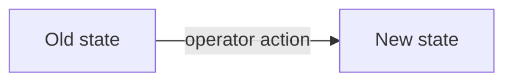

# Craft a PR

Goal: a reviewer understands the change in 60 seconds **without opening the diff**, and
every claim in the body is verifiable (a command, a count, a link).

Repo-specific facts (issue tracker, test commands, commit scopes, CI meaning) live in
the environment — look them up. This skill is the house style.

## Branch naming

- Ticketed work (the default): use the **issue tracker's generated branch name**. Copy
  it from the issue. This is what auto-links the PR — don't hand-roll a variant.
- Trim overly long generated slugs to the first meaningful words:
  `alice/proj-233-gateway-provenance` is better than the full issue title.
- Agent-authored work without a named owner: `<agent>/<slug>` (e.g.
  `codex/registry-proxy-ownership`).
- Untracked quick fixes: `<owner>/<slug>`. If it's worth a PR, it's usually worth an
  issue — create one first.
- Lowercase, hyphens, no dates, no `feature/`-style prefixes.

Look up the tracker in `docs/agents/issue-tracker.md` when that file exists; otherwise
match existing branch names in the repo.

## Commits

Conventional commits, because the squash subject becomes main's history:

```text
type(scope): imperative subject in lowercase, no period
```

- `type`: `feat` | `fix` | `chore` | `test` | `docs` | `refactor`.
- `scope`: the domain, not the path. Match scopes already in `git log`.
- Subject says what the change does for the system, not what you did:
  `fix(scheduler): unset dispatch interval leaves the shared schedule alone`.
- Intermediate commits on the branch may be rougher (they get squashed), but keep them
  reviewable — reviewers read them to follow your reasoning.

## PR title

Same conventional format as commits. Add the ticket when the branch name doesn't already
carry it: `feat(auth): persist sessions across device restore (PROJ-225)`. The title is
the future squash-commit subject — write it as the one line `git log` readers will see.

## Gate your own diff before pushing

Deterministic checks first — they are cheaper than any reviewer round.

Look up how this repo runs lint, typecheck, and tests (`package.json` scripts, Makefile,
pre-commit, CI workflow). Run the cheapest checks on the files you touched, then the
suites the diff actually covers.

If this repo keeps a review-invariants ledger (often
`.agents/skills/pr-review/repo-invariants.md`), re-read your own diff against it once.
Every finding you catch pre-push is a review round you don't pay for.

Treat CI green as whatever this repo's checks actually prove. If they only build or lint,
they do not prove tests ran — that evidence lives in Verification.

## PR body

Use this skeleton. If the repo has `.github/PULL_REQUEST_TEMPLATE.md`, fill that instead
when it already has these sections. Drop sections that are truly empty; never drop
Verification.

````markdown
## TL;DR

2–4 sentences in plain language: what breaks/changes today, what this PR makes true
instead, and for whom. No codenames without a one-clause explanation.



## Why

The incident, ticket, or product reason. Link the issue. For incident-driven work,
one paragraph of diagnosis with evidence (times in UTC, counts, log lines).

## What

- Bullets grouped by area, each stating the behavior change, not the file edited.
- Call out the rollback story when there is one ("unset the env var to fall back").

## Verification

- `pytest tests/test_cancel_restore.py` — 22 passed
- `npm test` — 743 passed
- [ ] Anything you did NOT run gets an unchecked box and a reason. Never silently skip.

## Decisions

The choices a reviewer would still want to question after trusting the diff — one line
each: what you chose, why, and the assumption you're now betting on.
- Doubled the poll timeout to 20s — clears the flaky CI case; assumes the download
  service never legitimately takes longer.
Skip mechanical choices. Write rows as you make the calls, not reconstructed at the end.

## Limitations

What is intentionally out of scope; tests not added; known gaps.

## Production

Migrations (name them), env vars to set and on which service, deploy order, and what to
watch after deploy. Required whenever any of those exist.
````

Rules that make it the house style:

- **Mermaid whenever a flow, state machine, schedule, or service boundary changes.**
  `flowchart` for states/paths/architecture (use `subgraph` for before/after), or
  `sequenceDiagram` for cross-service timing. Quote every label (`A["Awaiting-publish
  Post"]`), use `<br/>` for line breaks, keep it under ~15 nodes — a diagram that needs
  scrolling explains nothing. Pure one-liner fixes don't need one.
- **Verification is evidence, not assurance.** Exact commands with result counts. The
  unchecked-box convention for what wasn't run is mandatory honesty.
- **Production section is a contract with the person deploying.** The bar: exact vars,
  exact services ("After merge: set `SERVICE_URL` + `SERVICE_API_KEY` on worker **and**
  api").
- Write for a teammate who hasn't seen the branch: expand abbreviations, no
  agent-session shorthand, no "as discussed".

## After review rounds

Address every thread; when you push fixes, reply with the commit SHA that addresses it.
When a reviewer catches something recurring and this repo has a review-invariants
ledger, add one line there in the same PR — that ledger is where the team's review
memory accretes.
